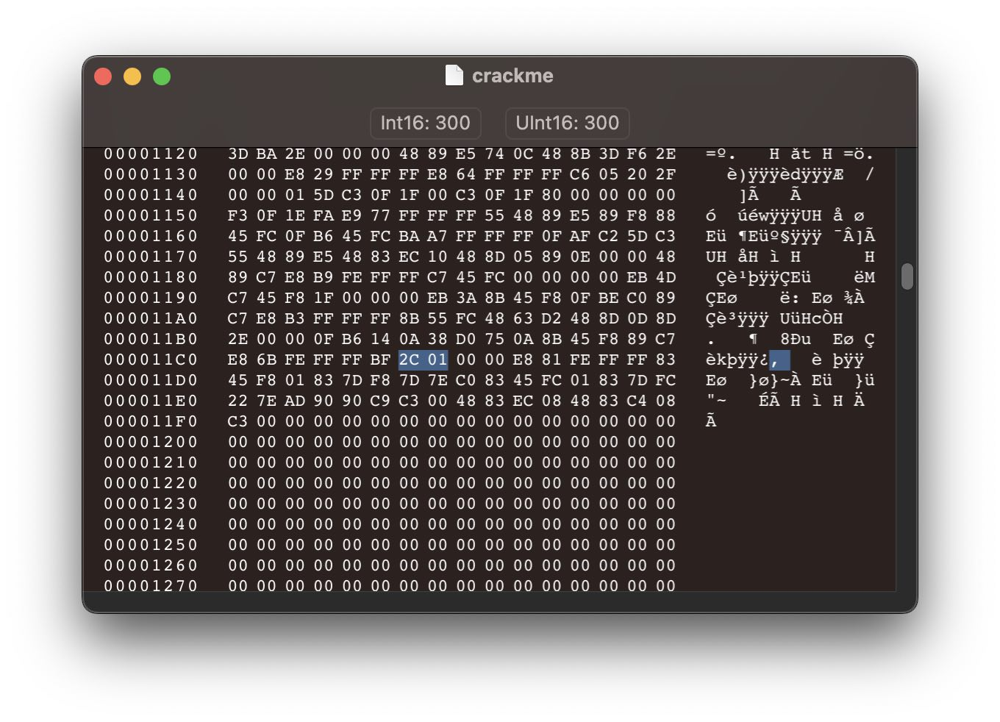
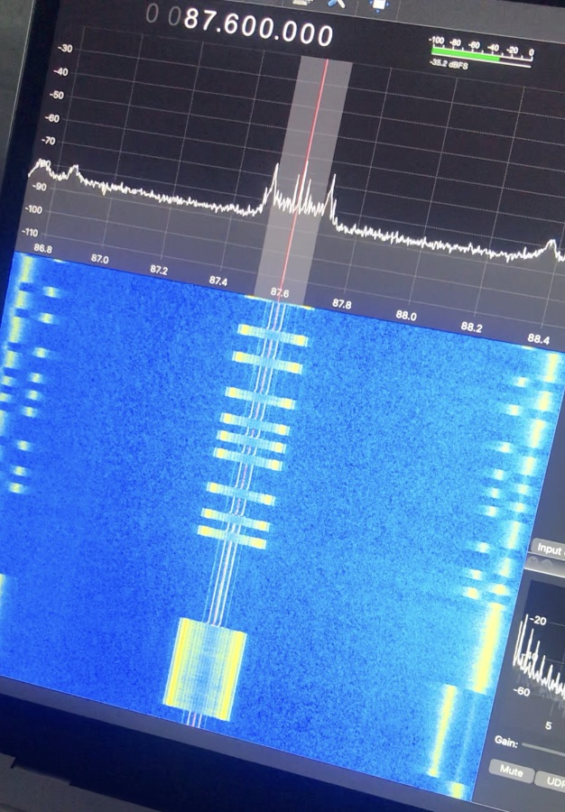

# BSides Brisbane 2023 - Writeups (Part 1: crypto, rev, IoT)

The BSides Brisbane CTF was an exciting mix of traditional jeopardy challenges, and
hardware/enterprise hacking. Huge props to the team who made this top quality CTF happen!

Unfortunately I didn't have enough time to properly try out all of the IoT challenges
and enterprise hacking challenges available, but at least I got to solve one of the IoT
challenges, one of the perks of an in-person CTF :)

## Overview

I could just make the write-ups about my solutions, but I like to also include the process I
followed because that's often a lot more valuable than just a solve script. I also hope that
it shows you that some challenges just take a lot of persistence!

@TableOfContents{"depth": 1}@

---

## Hard(ly) encryption (crypto - 100 points)

> While walking around the office during a red team engagement, you notice the following printed out on a piece of paper left on a keyboard: \x3c\x5d\x2e\x29\x4b\x69\x7f\x63\x77\x58\x3c\x63\x5e\x5e\x44\x1c\x39\x43\x36\x3e\x44\x5e\x11\x4c
>
> You also note the following on a postit note taped to the monitor of the same desk: Z1ON0101
>
> Can you work out what this means?"
>
> Author: bman

At first I thought it could be something similar to the [Vigenere cipher](https://en.wikipedia.org/wiki/Vigenère_cipher)
because that's simple and takes a key. Nothing else came to mind, so I started messing around in
Python trying to implement the Vigenere cipher but with bytes instead of the alphabet. After a
few minutes I hadn't found anything promising so I put the ciphertext into [CyberChef](https://gchq.github.io/CyberChef/)
hoping that maybe the `Magic` recipe would magically tell me something useful (it didn't 😅).

As I was looking through the script again I remembered that XOR existed (which I should've remembered
much earlier due to the challenge description and the random looking bytes in the encrypted message).
I quickly modified the script to perform XOR 'decryption' and sure enough, the flag popped right out.

To save time at the end I could've used CyberChef's `Unescape string` recipe (to interpret the hex
character codes) followed by the `XOR` recipe, which is good to know for next time.

Flag: `flag{XOR-is-not-crypto!}`

---

## Neo (crypto - 300 points)

> Help! I've forgotten the password to this old encryption service that's running on a server I no longer have access to. All I have is the source code and a copy of the encrypted password from when I used it last year :( Can you help me find what I changed the password to?
>
> Author: deluqs

We're provided with a Python program, and an encrypted password (along with its corresponding IV).
The provided program has two commands; `Encrypt a message`, and `Login`. The encryption used is
`AES` in `CBC` mode with a 16 byte block size and `pkcs7` padding (this becomes important later).

Luckily I had been reading about CBC padding oracle attacks the day before the CTF so that's the
first thing that came to mind. And spoiler, it turned out to be a padding oracle challenge :)

### Padding oracle attacks

A padding oracle attack is possible when CBC mode encryption is used and there is a way for an
attacker to verify whether a given ciphertext has valid padding when decrypted or not. Usually this comes in
the form of an API endpoint that has different error messages that distinguish between invalid
decrypted contents, and invalid decrypted padding. In our case, it's a Python program running over
TCP which we can interact with over netcat (as is usual for CTF challenges).

I'll do my best to briefly explain padding oracle attacks as I go, but I recommend reading
[this writeup for a cryptopals challenge](https://research.nccgroup.com/2021/02/17/cryptopals-exploiting-cbc-padding-oracles/)
for the best explanation of padding oracle attacks I've found so far! I ended up taking and
modifying their exploit script when I couldn't get mine to work (I really wanted to write
it myself but I also wanted to be fast cause of the CTF).

### What we're working with

```python
KEY = # redacted
password = # redacted

def encrypt(message, IV):
  cipher = AES.new(KEY, AES.MODE_CBC, iv=IV)
  padded = pad(message, 16, style='pkcs7')
  return cipher.encrypt(padded)

def decrypt(message, IV):
  cipher = AES.new(KEY, AES.MODE_CBC, iv=IV)
  decrypted = cipher.decrypt(message)
  unpadded = unpad(decrypted, 16, style='pkcs7')
  return unpadded

def login():
  try:
    print("Enter the IV:")
    IV = b64decode(sys.stdin.buffer.readline().rstrip())

    print("Enter the encrypted password:")
    ciphertext = b64decode(sys.stdin.buffer.readline().rstrip())

    plaintext = decrypt(ciphertext, IV)
    if plaintext == password:
      # ... print flag
    else:
      print("Access denied.")
  except:
    print("Error: malformed message")

def encrypt_message():
  print("Enter the IV:")
  IV = b64decode(sys.stdin.buffer.readline().rstrip())
  print("Enter the plaintext:")
  plaintext = b64decode(sys.stdin.buffer.readline().rstrip())
  ciphertext = encrypt(plaintext, IV)
  print(b64encode(ciphertext).decode("utf-8"))

while True:
  print(f"Choose an option:\n0: Encrypt a message\n1: Login\n> ", end='')
  choice = int(sys.stdin.buffer.readline().rstrip())
  if choice == 0:
    encrypt_message()
  elif choice == 1:
    login()
  else:
    print("Invalid choice!")
```
Figure 1: *important parts of the provided script source code (simplified for brevity).*

I've simplified the script by removing some unrelated input validation and such, but
for the purposes of our exploit the functionality is the same.

The most important thing to notice is that invalid padding will cause `Error: malformed message`,
and an incorrect password (with valid padding) will cause `Access denied.`. This is essential
for a padding oracle attack.

The program expects IVs, ciphertexts, and plaintexts to be inputted as base64.

### Writing the exploit

First we need to set up a way for the solver to interact with the service to check whether
a given ciphertext's padding is correct when decrypted (Figure 2). This can be done by using
pwntools to interact with the program, and then checking which error message we get. This
primitive is called the `oracle`, and it's all the information that the solver needs to fully
decrypt the ciphertext 🤯.

```python
from base64 import b64decode, b64encode
from pwn import *

SUCCESS = 0
ACCESS_DENIED = 1
MALFORMED = 2

BLOCK_SIZE = 16

iv = b64decode("ORYo2QThghEvpHv+wD3D6w==")
ciphertext = b64decode("01jm3AZpstbCZ3WQwbNAsQ==")

p = remote("neo.crypto.ctf.bsidesbne.com", 3302)
p.recvline()

def login(iv: bytes, password: bytes):
    p.recvuntil(b"> ")
    p.sendline(b"1")
    p.recvuntil(b"IV:\n")
    p.sendline(b64encode(iv))
    p.recvuntil(b"password:\n")
    p.sendline(b64encode(password))
    response = p.recvline()
    if response == b"Access denied.\n":
        return ACCESS_DENIED
    elif response == b"Error: malformed message\n":
        return MALFORMED
    else:
        print("key:", response.decode("utf8"))
        return SUCCESS

def oracle(iv, password):
    return login(iv, password) != MALFORMED
```
Figure 2: *harnessing the oracle 🔮.*

Next (and this is the part I took from [the handy article](https://research.nccgroup.com/2021/02/17/cryptopals-exploiting-cbc-padding-oracles/))
we can crack the plaintext byte by byte. To understand this part we need to take a look
at the PKCS#7 padding scheme. Say we have the plaintext `abc` and we need to pad it to
4 bytes. The only valid way to do this with PKCS#7 is to add a byte of value 1 to the
end of the message to get `abc\x01`. And if we needed to pad it to 5 bytes, we would have
to add 2 bytes of value 2 to the end of the message to get `abc\x02\x02`. You always add n
bytes of value n to the end of the message to make it the desired length. In the context of
this challenge, the message will get padded so that its length is a multiple of 16 (the
block size). If the server decrypts the message and the padding doesn't follow that scheme,
it'll return the `Error: malformed message` error message. Importantly, messages always need
to be padded up to the *next* multiple of the block size, so if a message is already 16 bytes,
it would need to be padded out to 32 bytes to avoid ambiguity.

The padding scheme on its own isn't particularly useful to us, but when combined with CBC encryption
and a padding oracle, it is. To encrypt the plaintext that we're given the ciphertext for, the
server first padded the message to 16 bytes with PKCS#7 padding, and then it encrypted it with
a CBC mode cipher. In the single block case which we're working with, CBC essentially just
XORs the plaintext block with the IV block and then encrypts the result with AES encryption. To
decrypt the message, CBC will decrypt the ciphertext with AES encryption, XOR the result with the
IV, and then check the padding. The idea of the attack is that we can figure out what the
output of the AES step is by influencing the XOR step through the IV and observing whether the padding
is correct or not. First we go through all possible final bytes for the IV and see which ones
result in valid padding. This will yield one or two valid values. One of them will be the original
value of that byte of course (we already know that it's valid), and if the message wasn't already
padded with `0x01` the other value will be the value that XORs to produce `0x01`. We want to know
which of these values produces a final byte of `0x01` which we can find out by modifying the second last byte of the
IV (see the script). Once we know which value produces a final plaintext byte of `0x01`, we can XOR
it with `0x01` to find what the last byte of the output from the AES stage was! We can now calculate
what value for the final byte will result in `0x02`, and then try all possible values for the second
last byte of the plaintext to find which one will produce a value of `0x02` (resulting in the valid
padding `\x02\x02`). We can continue this process until we know every byte of the output of the AES step!
XORing this with the IV (as CBC does) we can finally recover the original plaintext. If I lost you in
there somewhere, go check out [the article I've referenced too many times](https://research.nccgroup.com/2021/02/17/cryptopals-exploiting-cbc-padding-oracles/),
they explain it in much more detail!

```python
# ...

# Source: https://research.nccgroup.com/2021/02/17/cryptopals-exploiting-cbc-padding-oracles/
def single_block_attack(block, oracle):
    """Returns the decryption of the given ciphertext block"""

    # zeroing_iv starts out nulled. each iteration of the main loop will add
    # one byte to it, working from right to left, until it is fully populated,
    # at which point it contains the result of DEC(ct_block)
    zeroing_iv = [0] * BLOCK_SIZE

    for pad_val in range(1, BLOCK_SIZE+1):
        padding_iv = [pad_val ^ b for b in zeroing_iv]

        print("Working on %d" % pad_val)
        for candidate in range(256):
            padding_iv[-pad_val] = candidate
            iv = bytes(padding_iv)
            if oracle(iv, block):
                if pad_val == 1:
                    # make sure the padding really is of length 1 by changing
                    # the penultimate block and querying the oracle again
                    padding_iv[-2] ^= 1
                    iv = bytes(padding_iv)
                    if not oracle(iv, block):
                        continue  # false positive; keep searching
                break
        else:
            raise Exception("no valid padding byte found (is the oracle working correctly?)")

        zeroing_iv[-pad_val] = candidate ^ pad_val

    return zeroing_iv

# Source: https://research.nccgroup.com/2021/02/17/cryptopals-exploiting-cbc-padding-oracles/
def full_attack(iv, ct, oracle):
    """Given the iv, ciphertext, and a padding oracle, finds and returns the plaintext"""
    assert len(iv) == BLOCK_SIZE and len(ct) % BLOCK_SIZE == 0

    msg = iv + ct
    blocks = [msg[i:i+BLOCK_SIZE] for i in range(0, len(msg), BLOCK_SIZE)]
    result = b''

    # loop over pairs of consecutive blocks performing CBC decryption on them
    iv = blocks[0]
    for ct in blocks[1:]:
        dec = single_block_attack(ct, oracle)
        pt = bytes(iv_byte ^ dec_byte for iv_byte, dec_byte in zip(iv, dec))
        result += pt
        iv = ct

    return result

print(full_attack(iv, ciphertext, oracle))
```
Figure 3: *using our oracle to crack the plaintext byte by byte.*

This script can successfully crack the ciphertext given a minute or two (most of the time
is spent communicating with the oracle). The plaintext turns out to be `Mr@nd3r5oN2022\x02\x02`.
Given that the challenge wants us to figure out what the creator changed their password to,
`Mr@nd3r5oN2023` would be a very good guess. An excellent guess in fact 😅. Logging in
presents us with the flag.

Flag: `flag{yOu-n3ed-T0-sE3-th3-0rAc13}`

Solution: [solve_neo.py](bsides-brisbane-2023-writeups-part-1/solve_neo.py)

### Conclusion

Overall a very well made challenge! I enjoyed the final touch of having to 'guess' the new
password, it added a bit more personality to the challenge. I've only recently started
getting into crypto (the good kind), and this only made me want to learn more!

---

## crackme (rev - 150 points)

> I wrote the following program to calculate the flag. It takes a bit, please be patient.
>
> Author: deluqs

A good place to start with these kinds of challenges is to simply run the program to see
what it does. This gives us more context and can speed up the reverse engineering process
(although for a challenge like this that doesn't really matter).

```console
$ ./crackme 
Please wait for the flag to be calculated :)
```
Figure 4: *running the crackme.*

Nothing to really see there, so let's take a look at the decompilation using Ghidra.

```c
void main(undefined8 param_1,int param_2) {
  char extraout_AL;
  int local_10;
  int local_c;
  
  puts("Please wait for the flag to be calculated :)");
  for (local_c = 0; local_c < 0x23; local_c = local_c + 1) {
    for (local_10 = 0x1f; local_10 < 0x7e; local_10 = local_10 + 1) {
      encrypt((char *)(ulong)(uint)(int)(char)local_10,param_2);
      if (extraout_AL == DATA[local_c]) {
        putchar(local_10);
      }
      sleep(300);
    }
  }
  return;
}

void encrypt(char *__block,int __edflag) {
  return;
}
```
Figure 5: *the crackme decompiled using Ghidra.*

The first thing to notice is the `sleep(300)` line which runs every single iteration of
the double-nested loop. Waiting 5 minutes every iteration is bound to slow things down a
tad 😅. The other thing to notice is that although Ghidra seems to reckon that the `encrypt`
function is empty, it's actually not (which I can tell from looking at the assembly view).
It seems to be multiplying its first argument by `0xffffffa7`. However, I digress, we're
here to speed up the program, not fully reverse engineer it.

To remove the sleep we'll need to patch the binary, which isn't as tedious as it sounds
if you have a solid plan. There are two main ways we can go about patching out the sleep;
we can either replace all related instructions with `nop`s (which do nothing), or we can
change the duration from `300` to `0`. I usually find the second approach easier because
`300` (`0x12c`) will be easier to spot in a hex editor than some op codes. It also doesn't
involve googling what the op code is for `nop` which is nice.

First we need to locate the value that we're going to patch. To do so, click on the
`sleep(300)` line in Ghidra and the assembly view will highlight the related instructions.

```
  ...
001011c5 bf 2c 01        MOV        EDI,0x12c
         00 00
001011ca e8 81 fe        CALL       <EXTERNAL>::sleep
         ff ff
  ...
```
Figure 6: *disassembly of the instructions related to `sleep(300)`.*

First, `0x12c` gets moved into the `edi` register (which is where the first argument to a
function is usually placed), and then `sleep` gets called. Note that `0x012c` is stored
in the machine code with its bytes reversed because of [endiannes](https://en.wikipedia.org/wiki/Endianness),
but that doesn't matter for us because all we need to do is replace both bytes with `0x00`!

Now time to hop into a hex editor; I use `Octets` on macOS, but any old hex editor will
do. You could even use this [online hex editor](https://hexed.it) (which I've never used,
but it looks like it's good).


Figure 7: *the bytes we need to change (displayed in a hex editor).*

All we need to do now is backspace these two bytes and replace them with `00 00`. After
saving the file we can now run the program and get the flag basically instantly!

Flag: `flag{aint-nobody-g0t-time-for-d@t}`

---

## Cafeteria (rev - 300 points)

> The cleaners packed away the chairs and tables and I forgot how they were layed out. Can you help me figure out a layout that fits the our constraints?
>
> Author: deluqs

This is a classic rev challenge where we have to figure out valid inputs to get the flag.
After connecting to the service with netcat we're asked where the chairs and tables should
be put. Putting in `a` for both at least tells us that the program expects `0`s and `1`s to
denote where the chairs (and tables) should be placed.

```console
> nc cafeteria.rev.ctf.bsidesbne.com 1337
Help me cram as many people into this cafeteria as possible!
Where should I put the chairs?
a
Where should I put the corresponding tables?
a
Please 0's and 1's to denote where chairs are
```
Figure 8: *giving the program some dummy input.*

Next lets take a look at the program in Ghidra. Interestingly, when I opened a fresh copy
of the program in Ghidra to make the write-up, Ghidra decompiled it differently 😅 (and
better). The overall structure of the program can be deduced by reading the strings passed
to `puts` at different points in the code.

1. Use `gets` to read two streams of `0`s and `1`s from the user corresponding to the layouts
   of chairs and tables respectively (into buffers that Ghidra reckons are 140 bytes and
   128 bytes respectively, in reality they're both 126 bytes as evidenced by the following loop).
2. Iterate through the two strings to convert them from an ascii binary string to an array
   of integers (consisting of only `0`s and `1`s of course). Do so for 126 bytes of each.
3. Check whether any chairs or tables are on top of the bins. The bins are hardcoded to
   be at offsets `0x1d0` and `0x1d4`, which correspond to indices `0x1d0 / 4 = 116` and
   `0x1d4 / 4 = 117` respectively (the array elements are 4 bytes each).
4. Check whether any chairs and tables are in the same spot.
5. Check that every chair is next a table.
6. Check that there are at least 20 chairs (more than `0x13`).
7. Print the flag if all checks pass.

With that information in mind I basically just went with my first instinct: 20 alternating
chairs and tables (20 of each).

```python
from pwn import *

# alternating chairs and tables
chairs = b"10" * 20
tables = b"01" * 20

# pad to required length with 0s
chairs = chairs.ljust(126, b"0")
tables = tables.ljust(126, b"0")

p = remote("cafeteria.rev.ctf.bsidesbne.com", 1337)
p.sendline(chairs)
p.sendline(tables)
p.interactive()
```
Figure 9: *my solution script.*

And there we go, we get the flag printed after the ASCII art visualisation of our layout

```console
> nc cafeteria.rev.ctf.bsidesbne.com 1337
Help me cram as many people into this cafeteria as possible!
Where should I put the chairs?
101010101010101010101010101010101010101000000000000000000000000000000000000000000000000000000000000000000000000000000000000000
Where should I put the corresponding tables?
010101010101010101010101010101010101010100000000000000000000000000000000000000000000000000000000000000000000000000000000000000
Your cafeteria layout. '#' is a table, '.' is a chair, '@' is a rubbish bin:
 ------------------
|.#.#.#.#.#.#.#.#.#|
|.#.#.#.#.#.#.#.#.#|
|.#.#              |
|                  |
|                  |
|                  |
|        @@        |
 ------------------
flag{op3rat1ons_r3se4rch_i$_co0l}
```
Figure 10: *successfully solving the cafeteria challenge.*

Flag: `flag{op3rat1ons_r3se4rch_i$_co0l}`

### Conclusion

Overall a nice challenge, but I'm surprised it only got 4 solves! I think rev/pwn tend to
scare people away sadly.

---

## Rogue Transmitter (IoT Village - 400)

In-person the challenge was simply an antenna sitting on top of a platform in a pelican
case (which wasn't to be fiddled with). The challenge description (which has since left
my mind) was something like this:

> One of our office radios has been make weird transmissions every few minutes and
> we believe that it might be being used to exfiltrate data. See if you can tap the
> transmission and decode the message.

Luckily I had a software defined radio with me which I could use along with GQRX (a GUI for
software defined radios) to solve the challenge. Arguably GQRX isn't the best app out there,
but it's the one I had used in the past so it's what I went with. I've heard that
[Universal Radio Hacker](https://github.com/jopohl/urh) is a much better tool for the job.
If you're looking to get a software defined radio, I can definitely recommend the [RTL-SDR](https://www.rtl-sdr.com)
(although it seems to be quite a bit more expensive than I remember).

The first order of business was to figure out what frequency the message was being transmitted
on, so I started from the lowest frequency supported by my software defined radio
and started slowly increasing the frequency and stopping whenever I saw anything mildly interesting.
Eventually I came across a frequency which had a very weird looking signal. I was lucky that the
message was being transmitted as I scrolled past because otherwise I might've had to scroll through
quite a few times 😅. Talking to the challenge creator afterwards, I found out that generally
there's only a small number of frequency ranges that you actually have to check because the
rest aren't legal to transmit in.


Figure 11: *i didn't take a screenshot, so a screenshot of a video of the screen will have to do.*

Given that the frequency was so wide, slow, and digital, I was pretty certain that I had found the
right frequency (any real transmissions would be a lot faster). The frequency was around 87.6kHz.

After waiting for around 8 minutes for the current transmission to finish and the next one to start,
I decided to just video my screen as the transmission happened (because I hadn't figured out how
to record properly in GQRX fast enough).

I noticed that all of the blips in the transmission were the same length but there were 3
unique sizes of gaps between the blips. My first thought that the transmission could be using morse
code (with the smallest gap representing a dot and so on). Typing out the resulting morse code into
a translator yielded garbage. Next I started researching simple signal encoding methods and found
nothing other than morse code and other very similar encoding methods.

Later in the day the challenge creator (Josh) told us that the word `tap` in the challenge
description was meant to be a hint (very subtle to be fair), which pretty quickly led me to
discover tap encoding, a way of encoding messages with fixed length 'taps', perfect!

```
.. .  ... .  . .  .. ..  .. ...  . .  . ...  . ...  . .  ... .  ...
 .  .... ....  .. ...  . .....  .... ....  .. ...  .. ....  ... ...
  .. ..  .... ...

-> flaghaccallthethings
```
Figure 12: *translating tap code.*

And there we go!

Flag: `flag{haccallthethings}`

### Conclusion

Woohoo! Probably one of the coolest challenges that I got the chance to try, purely because I've never
done anything like it before :)
